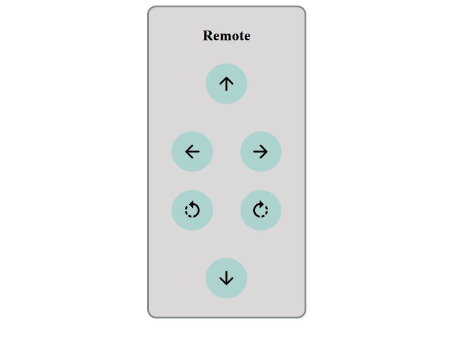

# car-simulation-socket
A remote controlled 2D car driving simulation using socket.IO. I tried to build this simulation of a remote controlled car while learning socket.IO for making a real [remote controlled rover](https://techyexplorer.com/rover-control-from-cell-phone/). It consists of only basic controls. For more advanced controls, something like [Phaser](https://phaser.io/) could be used.

### The Car


### The Remote


## How to run
- Install Node.js
 
```bash
> npm install
> node server.js
```

- Open http://localhost:3000 on your browser to see the car.
- The remote will be at http://localhost:3000/remote
